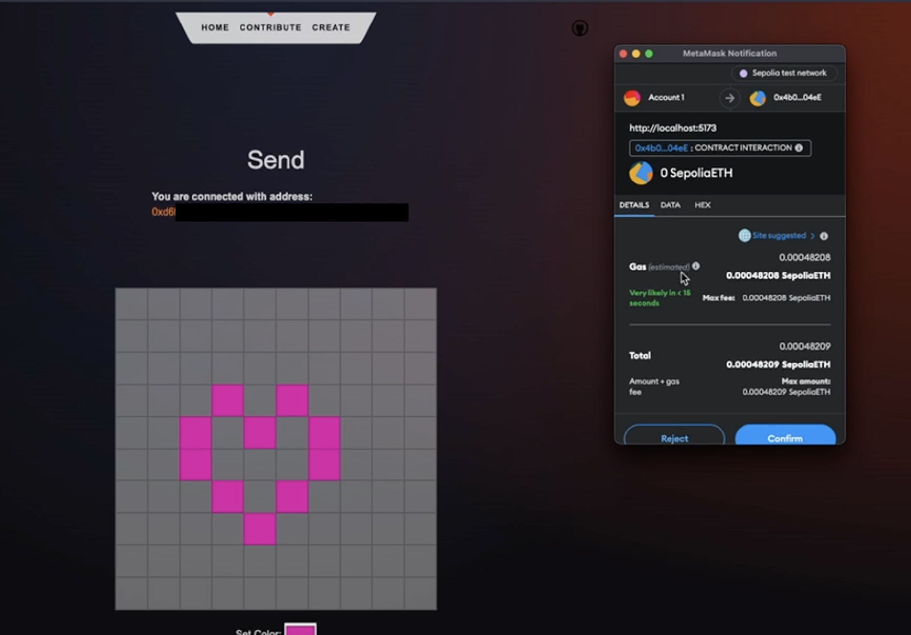

# C2H6O

## Start mongodb

First install and then start MongoDB. Then create the database with the following collections.

```
use EthernolDB
db.createCollection("users");
db.createCollection("translations");
db.createCollection("images");
db.createCollection("address");

db.users.createIndex({ address_id: 1 }, { unique: true })
db.addresses.createIndex({ address: 1 }, { unique: true })
```

## Start the server

```
cd backend
deno run -A --watch server.ts
```

## Start the frontend

```
cd backend
npm install
npm audit fix --force
```
There should be 6 moderate vulnerabilities otherwise run `npm audit fix --force` again.
For testing, run
```
npm run dev -- --open
```

## Using the application

The following screen shots show how to create a new link to a creator image.
Fans can paint on it and share their love for the creator by donating money to the creator!

### Screenshot showing the Creation page under Create


### Screenshot showing the painting options


### Screenshot showing the pop up for spending money for a donation




## Problems when testing

Browsers can pose quite a lot of problems when testing the workability of the server combined with accessing a database on the same machine.
This means that actions like `POST` and `GET` can be disallowed.
To run the Browser in a testing environment in the case of Brave and MacOS you should run
```
open -n -a /Applications/Brave\ Browser.app/Contents/MacOS/Brave\ Browser --args --user-data-dir="/tmp/chrome_dev_test"
```
Maybe the additional flag `--disable-web-security` is necessary.
Note that this also poses another difficulty as registering in Metamask does not work quite well.

In general final testing could not be accomplished as the server has to be pushed to production.
And the database as well.

## Concepts

The main idea is to have an image on the blockchain. Each pixel can be changed only once by a small donation after the initial creation. One image instance is unique and exists only once on the blockchain. It's implemented by a smart contract, has an own address and has only one owner defined on the blockchain. It's therefore comparable to an NFT, but it can be designed by users initially.

While all those components are defined in Solidity and running on the Ethereum blockchain (or test chains), the interaction is implemented in a website. This website allows the contribution to and creation of new images. The embedding of the blockchain functionality in the website is done by using web3.js and typescript. To build a more powerful website in time, Svelte and Deno are used. Svelte allows to build a frontend with high interactivity more easily. Deno is used to handle the backend and implementation of an additional database.

Because storing data persistently on the blockchain is expensive in order of fees it’s not suitable to store information about the transactions on the blockchain too. Therefore, an additional MongoDB database is implemented to allow tracking the own sent and received donations and creating useful statistics for the user and contributors. This lays a powerful foundation and grants a toolset for later implementations and further features.


